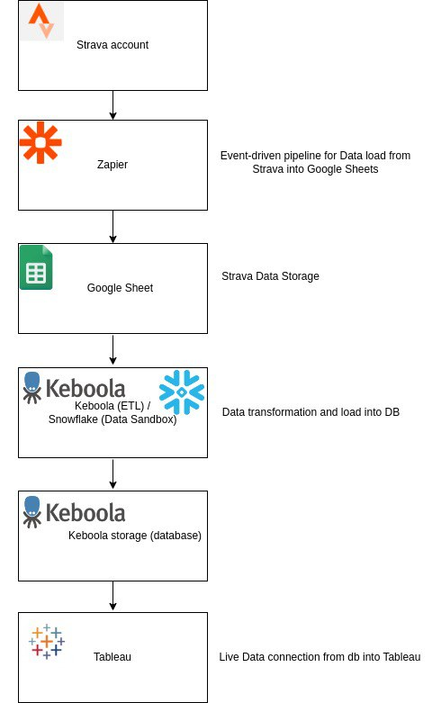

** Main goal **: Build an ETL data pipeline with real-time data from a personal Strava account with all activities list and its visualization through Tableau, in other words, each new activity (as well as all previous activities) should be triggered and transferred through the whole pipeline and finally appear in Tableau.

** Main ste-by-step article on [Medium] ** (https://medium.com/@karina.sokolenko/strava-etl-live-data-pipeline-with-tableau-visualization-302008ec3f0d?source=friends_link&sk=4f7aaa1e8298100652e2c2dbed2fd178).

** Architecture diagram: **

** Main tech stack: **
-Zapier (data extract from Strava, each new activity in Strava would be saved in Google Sheet as a new row using Zapier);
-Google Sheets (Strava data storage);
-Keboola and Snowflake (data transformation, extract, load and data storage);
-SQL (data manipulation and table creation);
-Tableau (data visualization);

